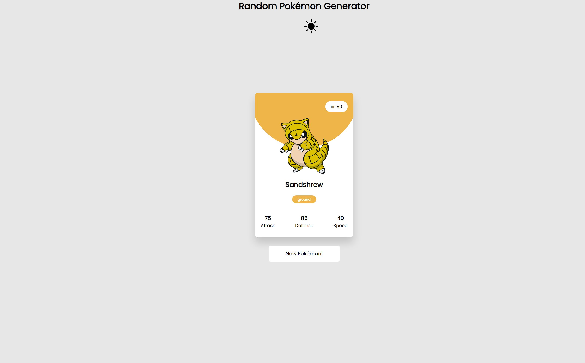
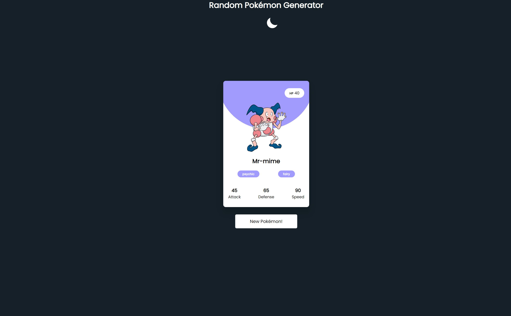
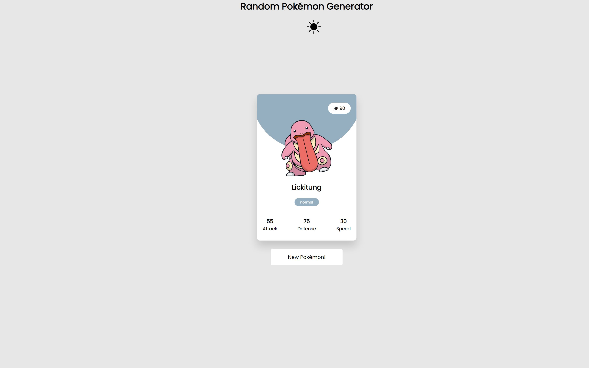

# Pokemon-Card-Generator


## **Introduction**

* Create an application when user click on a button, it generate a random pokemon name, image, and other stats using Pokemon API.
* Create a Dark and Light Toggle Button

## **Tech Stack used**
HTML, CSS, Javascript, [Poke API](https://pokeapi.co/)

## Learning Goals

* Learning how to use Pokemon API.
* Create a Dark and Light Mode Toggle
* Leveling up my HTML and CSS skills.

## Project Folder Structure:
There are three files in the Pokemon Card generator folder, the first is the HTML document called **index.html**. The next is the stylesheet named **style.css**, and the last is the script file called **main.js**.


## Setup Guide
**Step 1:** Fork the repository. Click the Code button in GitHub, make sure SSH is selected, and copy the provided git URL info

**Step 2:** Clone your forked repository. Clone the repo to your local machine with git clone followed by the git URL you copied.

```
git clone git@github.com:lhuynh100/PokemonCard-Generator.git
```

**Step 3:** After cloning the repository. Go to the repository. 

```
cd Pokemon-Card- Generator
```

**Step 4:** Open index.html file.
A random Pokemon card will be displayed when you press the Generate button, and a new pokemon card will generate. There will be a toggle button on dark and light modes.

## Screenshots


